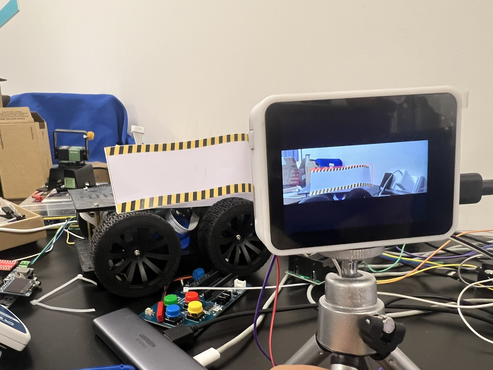

## Laser-Combat-Car
<p align="center">

</p>
## 项目介绍
[光电比赛官方规则](第十三届全国大学生光电设计竞赛实物赛道竞赛细则.pdf)
本项目是 **第十五届全国大学生光电设计竞赛** 的参赛作品，整体设计由 **Maixcam Pro** 与 **ESP8266** 协同完成：

- **ESP8266**：负责小车底盘的移动与基本控制。  
- **Maixcam Pro**：运行经过裁剪优化的 **YOLO v11 模型**，实现目标小车的识别与打击。同时通过 PID 控制二维云台，让摄像头能够精准对准目标。

### 系统主流程
1. 上电 → ESP8266 与 Maixcam Pro 启动  
2. Maixcam Pro 开始目标识别（无串口指令时不驱动云台）  
3. ESP8266 控制小车移动至预期位置并停止  
4. ESP8266 发送串口指令 → 激光启动  
5. Maixcam Pro 通过 PID 控制二维云台，调整摄像头对准目标  
6. 激光持续照射目标 **2 秒**  
7. Maixcam Pro 触发喇叭与 LED → 判定胜利

/maix-first_try-v1.0.3下是Maixcam pro端代码
/run_code是8266端代码
## 复刻流程

### Esp32 8266（Arduino端）
- 打开 `runcode/run_code.ino`
- 查看顶部的引脚号，根据引脚来接线
```C
#define IN1 D4
#define IN2 D3
#define ENA D1  
#define INB1 D6
#define INB2 D5
#define ENB D2  
```
- 烧录程序

### Maixcam Pro端
- 下载maixVersion==>[下载地址](https://wiki.sipeed.com/maixvision)
- 打开`maix-first_try-v1.0.3/`文件夹
- 在maixVersion上打包到Maixcam上

### 注意⚠️
- `maix-first_try-v1.0.3/config.json`为Maixcam程序相关参数

| 参数 |        | 
|------|------------|
| leser_pin    | 控制激光的引脚       | 
| tx_pin    | 和8266通讯的tx端       | 
| rx_pin    | 和8266通讯的rx端  |
| port0_pid   | 控制相机二维云台舵机的PID参数     | 

<figure>
  
  <figcaption>MaixCAM Pro 开发板 IO 口示意图</figcaption>
</figure>

- Maixcam和云台接线就相机的TX0和RX0端
- 开机蜂鸣器端口会一直响，开机后就会让他初始化为零了，可以先拔掉。
- Maixcam的rx_pin 15端口要是开机前就和8266接着会导致Maixcam开机不了，所以建议先端口15端口后开机后再接上去。

## BOM 表
| 序号 | 名称                       | 规格                                                                | 数量 | 价格 | 备注                                          | 链接                                                                                                                                                                                                                                                                                                     |
| :--- | :------------------------- | :------------------------------------------------------------------ | :--- | :--- | :-------------------------------------------- | :------------------------------------------------------------------------------------------------------------------------------------------------------------------------------------------------------------------------------------------------------------------------------------------------------- |
| 1    | Maixcam pro                | CAM Pro(含电池) 内置镜像卡                                          | 1    | 596  | 作为AI摄像头                                  | https://item.taobao.com/item.htm?id=846226367137                                                                                                                                                                                                                                                         |
| 2    | TB6612 FNG双路电机驱动模块 | 【焊接排针】TB6612双路驱动模块带稳压版【多仓发货 大部分区域次日达】 | 1    | 42   | 作为减速电机驱动板                            | https://detail.tmall.com/item.htm?id=645944642035&mi_id=0000f1McOXaTAUkE5JDB20mGM-qJVSsq2O8KxCeTOCk2usU&pvid=00aae127-ba56-418c-b5e4-3ec6f692cf67&scm=1007.56608.446695.0&skuId=5621113741702&spm=tbpc.boughtlist.repurchaseitem.d1.5cef2e8dZtWixR&xxc=home_recommend                                    |
| 3    | 小车开发板底盘             | 底盘不带控制板                                                      | 1    | 245  | 作为小车底盘                                  | https://item.taobao.com/item.htm?id=570479397628&mi_id=00002yqogRWefo-oNQjrTm4M49fsv2VXGY_UOL5syoeOpyw&spm=tbpc.boughtlist.suborder_itemtitle.1.5cef2e8dZtWixR                                                                                                                                           |
| 4    | 二维电动云台               | 简易二维云台（20kg总线舵机）;不含控制系统                           | 1    | 180  | 作为相机的二维云台，用于让Maixcam跟踪目标对象 | https://item.taobao.com/item.htm?id=630117220008&mi_id=0000gTzzBcdKS4MFVyfpOmWshXzpD-kiKADwrVg5lynEb6g&spm=tbpc.boughtlist.suborder_itemtitle.1.5cef2e8dZtWixR                                                                                                                                           |
| 5    | 舵机驱动板                 | USB/TTL调试板（送数据线）                                           | 1    | 22   | 二维云台的驱动板                              | https://item.taobao.com/item.htm?id=586685736957&mi_id=0000oujnpDKLfuJhgV55Dw1YRFroumJs9RTw3B17eteYqSs&spm=tbpc.boughtlist.suborder_itemtitle.1.5cef2e8dZtWixR&skuId=5195518882317                                                                                                                       |
| 6    | 12V电源                    | 12V 2550mAh安全电池E326S(亿纬锂能电芯)+拓展线束包+带3C认证1A充电器  | 1    | 79   | 作为小车的总电源                              | https://detail.tmall.com/item.htm?abbucket=20&id=657166348854&mi_id=0000XqU-Gny9iq1mm1EaAtD8lPM9cLevDBZTkSlmNZ2qpMg&ns=1&priceTId=2150462a17592978510598481e0e72&skuId=4978132892219&spm=a21n57.1.hoverItem.6&utparam=%7B%22aplus_abtest%22%3A%227b368999d4d3e49b422cefe85e9a4975%22%7D&xxc=taobaoSearch |
|   7   |        总计                    |                                                                     |      |     1164(元) |                                               |                                                                                                                                                                                                                                                                                                          |
                                                                                                                                                                                                                                                                                                                                                                                                                                                     


## 模型训练
<p align="center">

</p>

本项目的数据集通过 **官方线上标注工具** 完成，随后使用 **YOLO v11** 进行训练，并将模型裁剪转换为最终的 **ONNX 模型**。  
识别准确率可达 **97% 以上**，几乎不存在漏检情况。  
尽管整个训练与转换过程较为繁琐，但在熟悉流程后，后续使用官方工具训练仅需 **约 30 分钟** 即可完成。

- ⚠️注意
模型文件存在`maix-first_try-v1.0.3/model/640x224.7z`，运行需要提前传入Maixcam文件夹内，并修改正确路径位置`maix-first_try-v1.0.3/main.py`，里面最上面定义`MODEL`,更改为实际存放模型的位置。


## Img
- **剩下一下小车相关图片视频了**

### 小车底盘
<p align="center">

</p>


### pid图像识别
<video controls src="src/db1c7a538065c3b661300650d142a9ff.mov" title="Title" width="400" ></video>

### 小车运行效果（早期）
<video controls src="src/IMG_9369.MOV" title="Title" width="400" ></video>

### 最终小车形态

<p align="center">

</p>


## 缺陷
- [ ] 小车走的固定路线，行走轨迹固定，无法灵活应变不同场景。
- [ ] 仍有优化空间，电机配备的减速电机，理论上可以事实获取到小车的实时速度。同时Maixcam上有imu传感器，配合起来使用就可以做到一定效果的小车场内定位了

## 后续优化
- 小车上ROS2，能勾让小车反应给实时，且同时方便调试。
- 添加传感器，能勾实现一点的建图能力。同时也方便后续实现巡航功能。